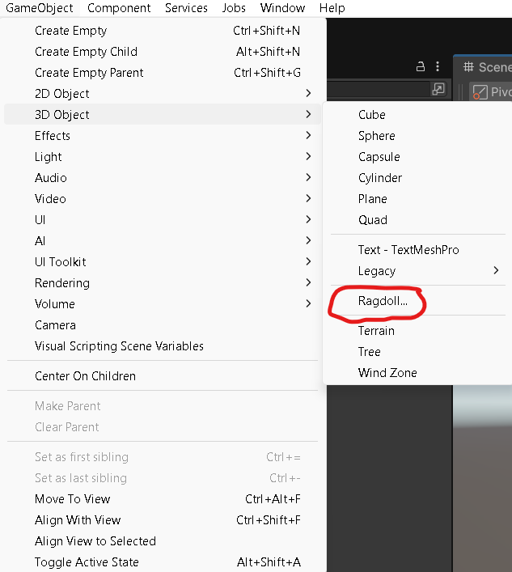
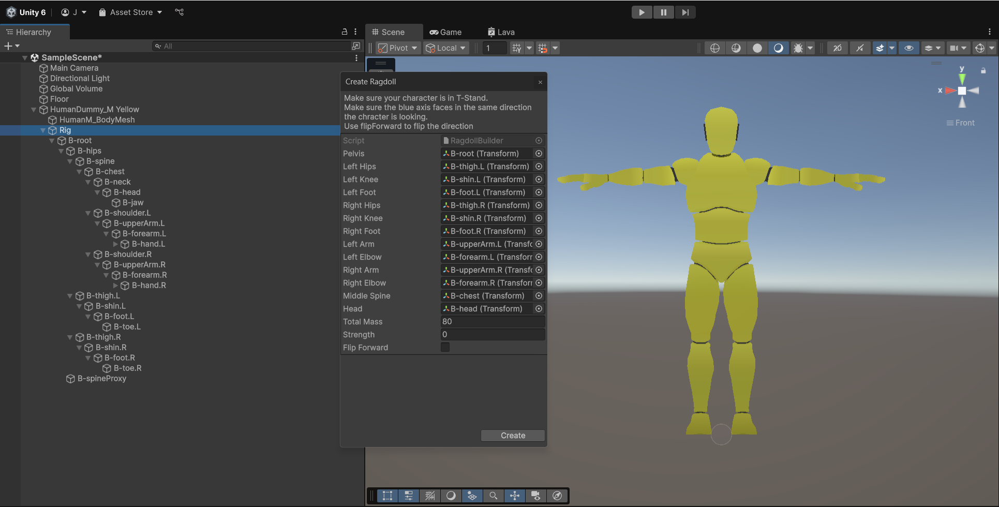

# Humanoid Ragdoll

## Description
Humanoid ragdolls are a physics simulation of a limp humanoid body. If a character seems to fall to the floor naturally as if they had suddenly passed out, a ragdoll is likely being used to achieve that effect. They are utilized in a wide range of games, though primarily in PVP-oriented games such as first-person shooters. They are often used when a humanoid character becomes unconscious in a game or is knocked down.

The demo provided showcases what an average ragdoll looks like. Press the "toggle" button to toggle the ragdoll on and off, and the "reset" button to reset the ragdoll to its original position.

## Implementation
1. Import or create a rigged humanoid character
Note: This step can be difficult, but it is out of the scope of this writeup. Many tutorials are available online on how 	to create and import a rigged humanoid character.

2. Open the Unity Ragdoll Creator (GameObject -> 3D Object -> Ragdoll...)


3. Drag the bones in the rigged humanoid character to the appropriate slots in the Unity Ragdoll Creator.


4. Set the appropriate mass for your character (this does not have to relate to real-world physics and can be exaggerated for your desired look)

5. Press "Create" (we can ignore strength for now since it is only useful for more complex physics simulations)

You will now have a humanoid ragdoll. Feel free to customize the joints, rigidbodies, and colliders on each bone of the ragdoll to achieve your desired look.

However, you may not want the character to always be in a ragdoll state. Sometimes they may need to be stiff, or even animated. To enable and disable the ragdoll effect at will, the recursive script below is a good general-purpose solution. If your performance is suffering when enabling and disabling the ragdoll, consider creating a list of each bone gameobject and only iterating through the objects in that list rather than using this approach, which iterates through every child object.

```csharp
using UnityEngine;

public class RagdollManager : MonoBehaviour
{
    [SerializeField] Transform root;

    //Toggles the ragdoll on or off
    public void ToggleRagdoll(bool on)
    {
        ToggleRagdoll_R(on, root);
    }

    //Private recursive helper function for ToggleRagdoll
    void ToggleRagdoll_R(bool on, Transform t)
    {
        //Toggle rigidbody using isKinematic and collider
        if (t.gameObject.GetComponent<Rigidbody>() != null) t.gameObject.GetComponent<Rigidbody>().isKinematic = !on;
        if (t.gameObject.GetComponent<Collider>() != null) t.gameObject.GetComponent<Collider>().enabled = on;

        //Recurse for each child
        for (int i = 0; i < t.childCount; i++)
        {
            ToggleRagdoll_R(on, t.GetChild(i));
        }
    }
}
